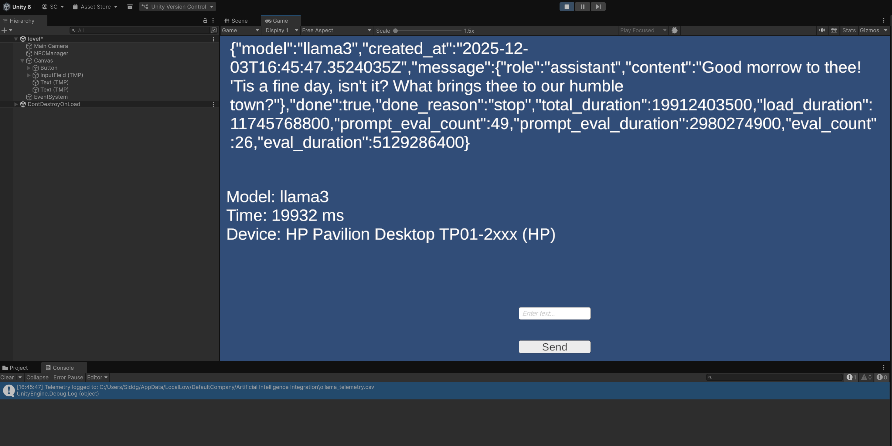
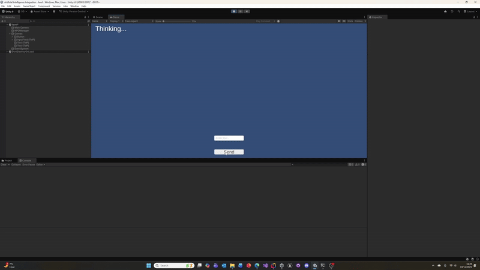

# AI-Powered Dynamic NPC Dialogue using Ollama and Unity

This technical commentary describes the implementation and integration of a local Large Language Model (LLM) system into a **Unity** game project to drive dynamic Non-Player Character (NPC) dialogue, leveraging the **Ollama** framework for local model inference.

## Implementation and Connection

The AI system is implemented as an asynchronous client-server architecture within the **Unity** game engine, using **C#** for scripting. The core connection logic resides in the `OllamaClient.cs` script, which acts as a lightweight **REST API client**.

The system connects to a locally running **Ollama** server, typically running at the default endpoint `http://localhost:11434`. The integration is achieved by using the `UnityEngine.Networking.UnityWebRequest` within a **Coroutine** (`Generate`) to make non-blocking HTTP POST requests. This allows the game loop to continue running while waiting for the LLM response, avoiding performance stalls. The client sends a **JSON payload** (conforming to the `ChatRequest` structure) to the Ollama `/api/chat` or `/api/generate` endpoint, specifying the desired local model (e.g., `llama3`) and the conversation messages.

## Data Processed and Generated

The system processes two main types of data for each interaction:

* **Input Data (Prompt Construction):** The player’s text input, retrieved from a UI element, is the primary input. This message is prepended with a crucial **`systemPrompt`** (e.g., "You are an NPC in a medieval town. Keep responses short, characterful, and friendly.") to define the character's persona and context. This combined prompt is serialized into the `ChatRequest` JSON object and sent to the Ollama API.

* **Output Data (Generation & Telemetry):**
    1.  **NPC Dialogue:** The primary output is the **generated text** from the LLM, which is displayed in the game's dialogue UI.
    2.  **Telemetry Data:** A custom `OllamaTelemetry` object is generated for every request, logging critical performance and contextual metrics. The `TelemetryLogger.cs` script then writes this data to a local CSV file (`ollama_telemetry.csv`). This logged data includes **inference latency** (`inferenceMs`), **model name** (`model`), and detailed runtime context (`platform`, `device`, `deviceType`). The final, structured response from the Ollama API is parsed to capture the LLM's output and, where possible, token counts (`tokens`, `tokensGenerated`).

***

## Tools, Frameworks, or APIs Used

The project relies on the following key technologies:

* **Tool/API:** **Ollama** is the central tool used to manage and run open-source Large Language Models (LLMs) locally, enabling the entire AI functionality.
* **Game Engine:** **Unity** is the platform where the C# client and gameplay logic are implemented.
* **Frameworks/APIs:**
    * **Ollama REST API:** Used for real-time model interaction.
    * **UnityWebRequest:** The C# class for handling HTTP communication.
    * **System.Diagnostics.Stopwatch:** Used for precise, non-game-time measurement of LLM inference latency.

***

## AI Enhancement of Gameplay and Workflow

The integration of the LLM via Ollama delivers substantial enhancements to both gameplay experience and the production workflow:

* **Enhanced Gameplay (Dynamic Immersion):** The AI transforms NPCs from characters with **static, pre-scripted dialogue trees** into dynamic, adaptive conversational partners. By reacting contextually to the player’s free-form input and adhering to a carefully designed `systemPrompt`, the NPC can generate unique, characterful responses in real-time, thereby increasing game immersion, unpredictability, and **replayability**. 
* **Enhanced Creativity and Production Workflow:** Utilizing **Ollama** ensures the AI core remains **local-first**. This is a massive advantage for development, allowing for extremely **rapid iteration** on character personalities by simply tweaking the `systemPrompt` without facing cloud API costs or network lag. Developers can easily swap between different LLMs (e.g., from an ultra-fast, small model for testing to a more creative, large model for final deployment) directly on their machine, streamlining the creative process for dialogue and character writing. The captured telemetry data further aids the production workflow by providing concrete metrics on the performance impact (latency) of different models, informing optimal design choices.

## Game

